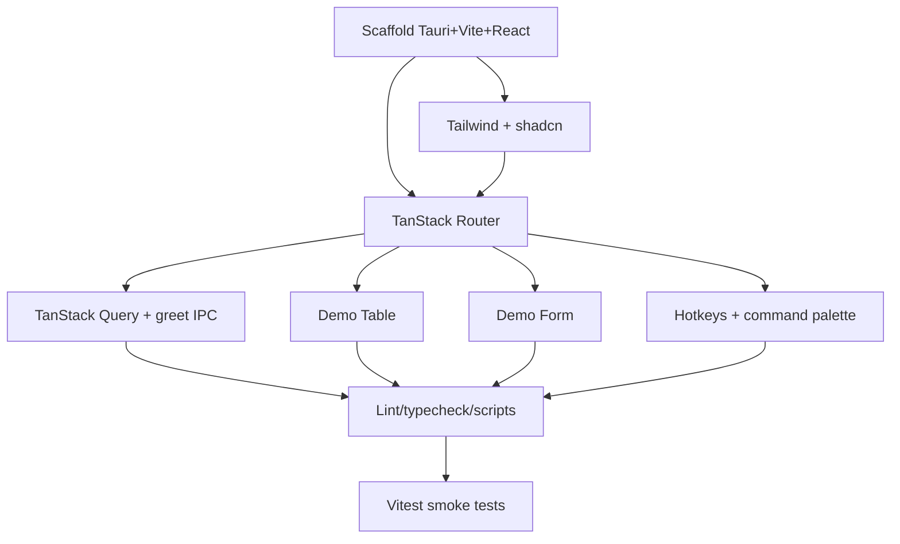

# Plan: Bootstrap - Tauri + React + TanStack Scaffold

**Spec:** docs/features/20260717015300-bootstrap/spec.md
**Created:** 2026-07-17
**Estimated Effort:** ~0.5-1 day
**Status:** Draft
**Coverage threshold:** none (scaffold; smoke tests only)

## 1. Overview

Create a runnable empty desktop app: Tauri 2 shell + Vite/React 19/TS frontend, wired with
TanStack Router/Query/Table/Form, `@tanstack/react-hotkeys` keybindings, and shadcn/ui +
Tailwind v4. Each TanStack lib is proven with a minimal, flashcard-flavored demo. No product
features. Approach and file layout mirror the `requi` bootstrap (proven stack). Alternative
rejected: file-based router (extra build plugin, unneeded for a 3-route scaffold).

## 2. Task Breakdown

| # | Task | Spec Ref | Files | Type | Est |
|---|------|----------|-------|------|-----|
| 1 | Scaffold Vite + React + TS + Tauri 2 (`npm create tauri-app` in temp, copy in, rewrite identity to `puredeck`) | AC-001, AC-002 | `package.json`, `vite.config.ts`, `src-tauri/**`, `index.html`, `.nvmrc`, `tsconfig*.json` | impl | 1h |
| 2 | Add Tailwind v4 + init shadcn/ui, add Button | AC-008 | `src/index.css`, `components.json`, `src/components/ui/button.tsx`, `src/lib/utils.ts` | impl | 1h |
| 3 | Wire TanStack Router: root layout + `/` + `/settings` + 404 | AC-003 | `src/router.tsx`, `src/routes/**`, `src/main.tsx` | impl | 1h |
| 4 | Wire TanStack Query: `QueryClientProvider` + `greet` Tauri command + demo query | AC-004, AC-011 | `src-tauri/src/lib.rs`, `src/lib/tauri.ts`, `src/routes/index.tsx` | impl | 1h |
| 5 | Demo TanStack Table (placeholder deck/card rows + empty state) | AC-005 | `src/components/demo-table.tsx` | impl | 0.5h |
| 6 | Demo TanStack Form (one validated field + submit, add-card placeholder) | AC-006 | `src/components/demo-form.tsx` | impl | 0.5h |
| 7 | Global keybinding (`Mod+K`) via `useHotkey` -> command-palette placeholder | AC-007 | `src/components/command-palette.tsx`, `src/routes/__root.tsx` | impl | 0.5h |
| 8 | Lint + typecheck + scripts (`start`->`tauri dev`, `lint`, `typecheck`, `format`, `test`) | AC-010 | `package.json`, `eslint.config.js` | impl | 0.5h |
| 9 | Vitest + RTL setup + smoke tests for TC-001..TC-006 | AC-002..007 | `vitest.config.ts`, `tests/setup.ts`, `tests/*.test.tsx` | test | 1.5h |

## 3. Execution Order

Spine: T1 -> T2 -> T3. T5/T6/T7 parallelize once Router (T3) exists. Tests (T9) last.

## 4. TDD Strategy

Scaffold work (T1-T2) is mostly config, so strict RED-first is impractical there. Apply
TDD where behavior exists (routing, query, table, form, hotkey) via Vitest + RTL.

### RED (failing tests first)
- `tests/*.test.tsx` cases for TC-001..TC-006 against expected selectors, written before the
  corresponding component is wired (spawned test-writer subagent, per pz-implement Phase 3).

### GREEN
- Implement each demo until its test passes. Mock `@tauri-apps/api/core` `invoke` in tests.

### REFACTOR
- Extract shared providers (query client, router, hotkeys) into `src/main.tsx`/`__root.tsx`.

## 5. File Changes

### New
- `package.json`, `vite.config.ts`, `index.html`, `.nvmrc`, `tsconfig.json`, `tsconfig.node.json` - frontend tooling
- `src-tauri/` (`Cargo.toml`, `tauri.conf.json`, `src/lib.rs`, `src/main.rs`, `build.rs`, `capabilities/`, `icons/`) - desktop shell
- `src/main.tsx`, `src/router.tsx`, `src/routes/{__root,index,settings,not-found}.tsx` - app entry + routing
- `src/lib/tauri.ts` - typed `invoke` wrappers; `src/lib/utils.ts` - `cn` helper
- `src/components/{demo-table,demo-form,command-palette}.tsx`, `src/components/ui/button.tsx` - demos + shadcn
- `src/index.css`, `components.json` - styling + shadcn config
- `eslint.config.js` - lint
- `vitest.config.ts`, `tests/setup.ts`, `tests/*.test.tsx` - test harness + smoke tests

### Modified
- `README.md`, `CLAUDE.md` - already written in the docs-skeleton step; adjust only if commands drift.

### Deleted
- none

## 5b. Design Gate Verdict (pz-implement mandatory check)

| Skill | Evaluated | Invoked | Reason |
|-------|-----------|---------|--------|
| pz-ddd | Yes | No | Scaffold introduces no domain model, aggregate, or boundary; demos are placeholders. Real Card/Deck domain arrives with a later feature. |
| pz-archetypes | Yes | No | No accounting/inventory/ordering/pricing shape here - pure tooling scaffold. |
| pz-codebase-design | Yes | No (implicit) | Module seams (`lib/tauri.ts` IPC wrapper, `app/providers.tsx`, code-based route tree) mirror the proven `requi` structure; no new deep interface to design this round. |

Verdict: none invoked - a bootstrap/plumbing ticket with no domain model to shape. Recorded per the mandatory gate.

## 6. Key Decisions (for ADR/Decision Log)

- **Tauri 2 over Electron**, **TanStack stack**, **`@tanstack/react-hotkeys` (alpha)**, **code-based routes** - all logged in [docs/adr.md](../../adr.md) (2026-07-17), mirroring `requi`.
- **Flashcard-flavored demos** (deck/card table, add-card form) over verbatim HTTP demos. Rationale: hints at the real domain, cheaper to evolve than off-domain placeholders. (Private Decision Log only - low weight.)
- **Vitest + RTL, no E2E this round** (vs Playwright). Rationale: scaffold smoke coverage; E2E is a later feature.

## 7. Risks and Mitigations

| Risk | Impact | Mitigation |
|------|--------|------------|
| Tailwind v4 + shadcn config churn (v4 dropped `tailwind.config`) | Setup friction | Follow the current shadcn "Tailwind v4 + Vite" guide (context7). |
| TanStack Hotkeys is alpha | API churn | Pin exact version; isolate behind `command-palette.tsx`. |
| `@tanstack/react-form` v1 API drift | Rework | Verify the validator/field API against the installed version before wiring. |
| Tauri OS prerequisites missing | `tauri dev` fails | Verified present (node 24.18, rust 1.97, Xcode CLT) before T1. |
| `npm create tauri-app` won't target non-empty dir | Scaffold fails | Scaffold in temp, copy in, rewrite identity (see learnings). |

## 8. Acceptance Verification

| AC | Criterion | Test(s) / Evidence | Status |
|----|-----------|--------------------|--------|
| AC-001 | Clean install | `npm install` -> exit 0, 332 packages, 0 vulnerabilities | Pass |
| AC-002 | Dev window launches | `should render the welcome heading and the Get started button` (home render) | Pass |
| AC-003 | Routing + nav | `should navigate to /settings and back to home via nav links`; `should render the settings route when history starts at /settings` | Pass |
| AC-004 | Query app-wide + demo resolves | `should render the greeting text returned by the mocked greet command` (+ Loading/Error tests) | Pass |
| AC-005 | Demo table renders + empty state | `should render a row per card...`; `should render an empty-state row when given no rows` | Pass |
| AC-006 | Demo form validates + submits | `should show a validation alert if the form is submitted empty`; `should show the added-card confirmation...` | Pass |
| AC-007 | Global hotkey | `should open the command palette when Mod+K is pressed`; `should run a command and close when a palette item is selected` | Pass |
| AC-008 | shadcn Button styled | `should render the welcome heading and the Get started button` (Button renders) | Pass |
| AC-009 | Build succeeds | `npm run build` -> exit 0 (tsc + vite, 2065 modules); `cargo build` src-tauri -> exit 0 | Pass |
| AC-010 | Lint + typecheck pass | `npm run lint` exit 0 (1 accepted shadcn Button warning); `npm run typecheck` exit 0 | Pass |
| AC-011 | `greet` IPC callable | `should render the greeting text...` asserts `invoke("greet",{name:"puredeck"})` called | Pass |

Test file: `tests/bootstrap.test.tsx` (12 tests) + `tests/setup.ts`. Full suite: 12 passed. `npm run tauri build` (full distributable bundle, AC-009 "Should") not run this session - the two build halves (`npm run build` + `cargo build`) both pass, which covers compile; full bundle packaging deferred.

### Deviations from plan

- Scaffold was seeded from a fresh `npm create tauri-app` (react-ts) template rather than copied from `requi`'s `src-tauri/` (requi's is loaded with later-feature deps: reqwest, pcap, hpack). Cleaner minimal baseline.
- Strict RED-first not applied to the scaffold: production code existed (from template) before tests; tests are honest characterization tests (green on first run, non-tautological). Per pz-implement Phase 3, allowed for scaffold/config work.
- `settings.tsx` split into its own route file (plan listed `src/routes/**`); matches the code-based-route pattern.
