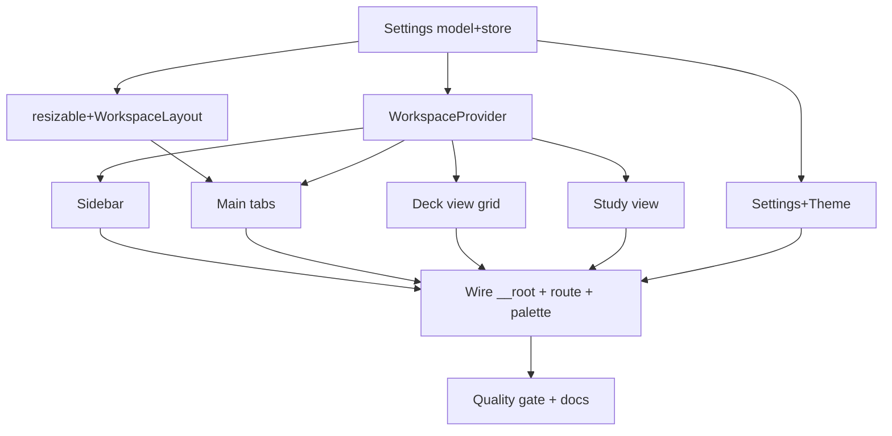

# Plan: Layout - App Shell (requi-mirrored)

**Spec:** docs/features/20260717112650-layout/spec.md
**Created:** 2026-07-17
**Estimated Effort:** ~1.5-2 days
**Status:** Draft
**Coverage threshold:** none (Vitest, no enforced threshold)

## 1. Overview

Turn the bootstrap chrome (top-nav + `/` + `/settings` routes) into a **requi-style shell**: one `/`
route rendering `SettingsProvider -> ThemeProvider -> WorkspaceProvider -> WorkspaceLayout`
(resizable Sidebar `│` Main). Content is driven by an in-app tab strip (deck / Study / Settings),
not routes. Add a `ThemeProvider` (light/dark/system) and a pluggable `SettingsStore`
(`plugin-store` in-app, in-memory in dev/test). Surfaces render as scaffolds over static demo decks.
Every token, class, and layout idiom is copied from `requi` (radius 0, neutral OKLCH, `bg-accent` +
`inset primary` active, full-bleed panes, flush bar actions) - **not reinvented**.

Alternative rejected: keeping route-per-surface (would fight the requi tab model the user asked for and
break "multiple decks open at once"). Chosen: single route + WorkspaceContext-driven tabs, mirroring requi.

## 2. File Structure

```
src/
  main.tsx                         (mod) mount RouterProvider under AppProviders (unchanged shape)
  router.tsx                       (mod) route tree = [rootRoute] only; drop settingsRoute
  routes/
    __root.tsx                     (mod) RootLayout wraps Settings->Theme->Workspace providers + Outlet + palette
    index.tsx                      (mod) HomePage renders <WorkspaceLayout/> (was demo page)
    settings.tsx                   (del) Settings becomes a tab, not a route
  app/
    providers.tsx                  (mod) keep Query+Hotkeys; add env-branched store factory helper
  lib/
    settings/
      settings.ts                  (new) Settings type, DEFAULT_SETTINGS, mergeSettings, PanelGroupKey
      settings-context.tsx         (new) SettingsProvider + useSettings (load/save, functional update)
      tauri-store.ts               (new) createTauriSettingsStore (plugin-store LazyStore)
      in-memory-store.ts           (new) createInMemorySettingsStore (dev/test)
      store-factory.ts             (new) createSettingsStore() env-branch (isTauri ? tauri : in-memory)
    theme/
      theme-context.tsx            (new) ThemeProvider + useTheme (mode, matchMedia, .dark toggle)
      effective-mode.ts            (new) resolveEffectiveMode(mode, prefersDark)
    workspace/
      model.ts                     (new) Deck, Card (scaffold, typed to glossary), Tab types + synthetic ids
      demo-data.ts                 (new) static scaffold decks/cards
  components/
    workspace/
      workspace-layout.tsx         (new) horizontal ResizablePanelGroup: Sidebar | handle | Main
      workspace-context.tsx        (new) WorkspaceProvider: decks, tabs, selection, open/close/reorder/activate
      sidebar.tsx                  (new) brand header + deck list
      main.tsx                     (new) tab strip + active-surface switch + empty state + Mod+B
      content-tabs.tsx             (new) sortable tab strip (dnd-kit) + new-tab
      deck-view.tsx                (new) pane-toolbar (flush Study action) + full-bleed card grid
      card-grid.tsx                (new) editable KV grid (front|back|delete, trailing blank row)
      study-view.tsx               (new) flashcard flip + grade buttons + progress
      settings-view.tsx            (new) sub-tab bar; Theme pane + Shortcuts pane (separate)
    ui/
      resizable.tsx                (new) shadcn/react-resizable-panels wrapper (mirrored from requi)
      tabs.tsx                     (new, if needed) shadcn Tabs for settings sub-tabs
  index.css                        (mod) pin --radius: 0 + requi scrollbar/cursor base layer
src-tauri/
  src/lib.rs                       (mod) register tauri_plugin_store::Builder
  Cargo.toml                       (mod) tauri-plugin-store = "2"
  capabilities/default.json        (mod) add "store:default"
tests/
  layout-shell.test.tsx            (new) TC-001..004, 010, 011
  theme.test.tsx                   (new) TC-008, 009
  settings-store.test.ts           (new) TC-002/003 persistence, TC-012 merge
  deck-view.test.tsx               (new) TC-005
  study-view.test.tsx              (new) TC-006
  settings-view.test.tsx           (new) TC-007
components.json                    (unchanged)
package.json                       (mod) + react-resizable-panels, @dnd-kit/*, @tauri-apps/plugin-store
```

Removed from bootstrap once surfaces exist: `components/demo-table.tsx`, `demo-form.tsx` (their TanStack Table/Form usage moves into `card-grid`/scaffold, or is dropped). `command-palette.tsx` stays, rewired to open tabs.

## 3. Task Breakdown

Interfaces are named up front so neighbouring tasks agree (step-12 self-review checks this).

### Task 1: Settings model + store + persistence
**Files:** Create `src/lib/settings/{settings.ts,settings-context.tsx,tauri-store.ts,in-memory-store.ts,store-factory.ts}`; Modify `src-tauri/{src/lib.rs,Cargo.toml,capabilities/default.json}`, `package.json`. Test `tests/settings-store.test.ts`.
**Interfaces:**
- Produces: `type Settings`, `DEFAULT_SETTINGS`, `mergeSettings(base, unknown): Settings`, `type SettingsStore = { load(): Promise<Settings>; save(s: Settings): Promise<void> }`, `type PanelGroupKey = "workspace"`, `type PanelLayout = Record<string, number>`; `createTauriSettingsStore()`, `createInMemorySettingsStore(initial?)`, `createSettingsStore()`; `SettingsProvider`, `useSettings()` returning `{ settings, saveLayout, saveSidebarCollapsed, saveOpenTabs, saveThemeMode }`.
- [ ] Write failing test: in-memory store round-trips; `mergeSettings` fills defaults from a partial/garbage blob (TC-012).
- [ ] Confirm FAIL (modules absent).
- [ ] Implement model + stores + provider; register Rust plugin + capability.
- [ ] Confirm PASS; `cargo build` in src-tauri exits 0.
- [ ] Commit (`feat(layout): AC-009 settings store + persistence`).

### Task 2: ui/resizable wrapper + WorkspaceLayout split
**Files:** Create `src/components/ui/resizable.tsx`, `src/components/workspace/workspace-layout.tsx`. Modify `package.json` (react-resizable-panels). Test `tests/layout-shell.test.tsx` (split + resize-persist portion).
**Interfaces:**
- Consumes: `useSettings` (Task 1); `Sidebar`, `Main` (Tasks 4/5 - stub placeholders first).
- Produces: `ResizablePanelGroup`, `ResizablePanel`, `ResizableHandle`; `WorkspaceLayout` reading `settings.layouts.workspace`, `defaultSize 20% min 12% max 40%`, `onLayoutChanged -> saveLayout("workspace", ...)`, and hiding the sidebar panel when `settings.sidebarCollapsed`.
- [ ] Write failing test: renders a resize `separator` + sidebar/main regions; collapsed hides sidebar.
- [ ] Confirm FAIL.
- [ ] Implement wrapper + layout (sidebar/main stubbed).
- [ ] Confirm PASS.
- [ ] Commit (`feat(layout): AC-001 AC-002 resizable collapsible shell`).

### Task 3: WorkspaceProvider (decks, tabs, selection)
**Files:** Create `src/lib/workspace/{model.ts,demo-data.ts}`, `src/components/workspace/workspace-context.tsx`. Test covered via shell/deck/study tests.
**Interfaces:**
- Consumes: `useSettings` (openTabIds/activeTabId persistence).
- Produces: `type Deck = { id: string; name: string; cards: Card[] }`, `type Card = { id: string; front: string; back: string }`, synthetic ids `SETTINGS_TAB_ID`, `STUDY_TAB_ID` (+ `studyTabId(deckId)` if per-deck), `type Tab`; `WorkspaceProvider`, `useWorkspace()` returning `{ decks, selectedDeckId, openTabIds, activeTabId, openDeck(id), openSettings(), openStudy(deckId), setActiveTab(id), closeTab(id), reorderTabs(ids) }`. Neighbour-activation on close (E-3), stale-active fallback (E-8).
- [ ] Write failing test (via TC-004 tab open/switch/close driven from Main in Task 6).
- [ ] Confirm FAIL.
- [ ] Implement context + demo data.
- [ ] Confirm PASS.
- [ ] Commit (`feat(layout): AC-004 workspace tab/selection state`).

### Task 4: Sidebar (brand + deck list)
**Files:** Create `src/components/workspace/sidebar.tsx`. Test `tests/layout-shell.test.tsx` (sidebar portion, TC-001).
**Interfaces:**
- Consumes: `useWorkspace` (decks, selectedDeckId, openDeck).
- Produces: `Sidebar` - `h-9` brand header (`bg-muted/30 border-b`, text "PureDeck"), deck list rows (`text-[13px] py-1`, hover/selected `bg-accent`, name only), click -> `openDeck(id)`. `role`/`aria-label` for the tree region.
- [ ] Write failing test: brand + a row per demo deck; click opens/selects.
- [ ] Confirm FAIL. Implement. Confirm PASS.
- [ ] Commit (`feat(layout): AC-003 sidebar deck list`).

### Task 5: Main - tab strip + surface switch + empty + Mod+B
**Files:** Create `src/components/workspace/{main.tsx,content-tabs.tsx}`. Test `tests/layout-shell.test.tsx` (TC-004, TC-010, TC-003 Mod+B).
**Interfaces:**
- Consumes: `useWorkspace` (tabs), `useSettings` (saveSidebarCollapsed), `useHotkey` (`Mod+B`); renders `DeckView`/`StudyView`/`SettingsView` (Tasks 6-8).
- Produces: `Main`; `ContentTabs` - sortable strip (dnd-kit `horizontalListSortingStrategy`), active = `bg-accent shadow-[inset_0_-2px_0_0_var(--primary)]`, `×` close, `+` new; active-surface switch by `activeTabId`; empty state when `activeTabId == null`.
- [ ] Write failing tests: TC-004 (open/switch/close/reorder), TC-010 (empty), TC-003 (Mod+B collapse persists).
- [ ] Confirm FAIL. Implement. Confirm PASS.
- [ ] Commit (`feat(layout): AC-004 AC-010 tab strip + empty state`).

### Task 6: Deck view - pane-toolbar + full-bleed card grid
**Files:** Create `src/components/workspace/{deck-view.tsx,card-grid.tsx}`. Test `tests/deck-view.test.tsx` (TC-005).
**Interfaces:**
- Consumes: `useWorkspace` (active deck), `openStudy`.
- Produces: `DeckView` - pane-toolbar (`items-stretch`, no padding: title+count cell `flex-1`, icon-only `bg-primary` Study `h-full border-l` flush), `CardGrid` full-bleed (`grid` cols `1fr 1fr 2.25rem`, `border-t border-l`, cells `border-r border-b`, `h-9` mono inputs, trailing blank row). Scaffold rows from the deck's static cards; delete/blank-row are visual scaffold (no persist).
- [ ] Write failing test: toolbar title/count + flush Study action; a grid cell per card + trailing blank row; grid has no outer padding wrapper.
- [ ] Confirm FAIL. Implement. Confirm PASS.
- [ ] Commit (`feat(layout): AC-005 deck view card grid`).

### Task 7: Study view - flip + grade
**Files:** Create `src/components/workspace/study-view.tsx`. Test `tests/study-view.test.tsx` (TC-006).
**Interfaces:**
- Consumes: `useWorkspace` (deck cards for the study sequence), `useHotkey` (`Space` flip).
- Produces: `StudyView` - `Card N / M` progress, flashcard front, click/Space flip -> back + Again/Hard/Good; grade advances index + resets to front. Grades hidden until flipped.
- [ ] Write failing test: front shown + grades hidden; flip reveals back + grades; grade advances + re-hides.
- [ ] Confirm FAIL. Implement. Confirm PASS.
- [ ] Commit (`feat(layout): AC-006 study flip + grade`).

### Task 8: Settings view - sub-tabs (Theme | Shortcuts) + ThemeProvider
**Files:** Create `src/components/workspace/settings-view.tsx`, `src/lib/theme/{theme-context.tsx,effective-mode.ts}`, `src/components/ui/tabs.tsx` (if not present). Test `tests/settings-view.test.tsx` (TC-007), `tests/theme.test.tsx` (TC-008, TC-009).
**Interfaces:**
- Consumes: `useSettings` (theme.mode, saveThemeMode).
- Produces: `SettingsView` - sub-tab bar (`Theme`,`Shortcuts`), each its own pane; Theme pane = segmented Light/Dark/System (requi filled/outline group) calling `saveThemeMode`; Shortcuts pane = static list. `ThemeProvider`/`useTheme`: mode + `resolveEffectiveMode(mode, matchMedia)` + `.dark` toggle in `useLayoutEffect`, live OS listener.
- [ ] Write failing tests: TC-007 (only active section visible), TC-008 (mode switch toggles `.dark` + persists), TC-009 (system follows matchMedia + reacts).
- [ ] Confirm FAIL. Implement. Confirm PASS.
- [ ] Commit (`feat(layout): AC-007 AC-008 settings sections + theme`).

### Task 9: Wire providers in __root + single route + palette rewire
**Files:** Modify `src/routes/__root.tsx`, `src/router.tsx`, `src/routes/index.tsx`, `src/app/providers.tsx`, `src/components/command-palette.tsx`; Delete `src/routes/settings.tsx`. Test `tests/layout-shell.test.tsx` (TC-011).
**Interfaces:**
- Consumes: all providers/components above.
- Produces: `RootLayout` = `SettingsProvider(store) -> ThemeProvider -> WorkspaceProvider -> (Outlet + CommandPalette)`; `index.tsx` renders `<WorkspaceLayout/>`; route tree = `[rootRoute]`; palette commands open tabs (`openSettings`, `openStudy`, deck open) not `navigate`.
- [ ] Write failing test: exactly one route (`/`); `Mod+K` -> "Open Settings" opens the Settings tab; no `/settings` route.
- [ ] Confirm FAIL. Implement (remove settings route). Confirm PASS.
- [ ] Commit (`feat(layout): AC-011 single-route shell + palette tabs`).

### Task 10: Quality gate + docs
**Files:** Modify `README.md`, `CLAUDE.md`/`docs/learnings.md` if drift; `src/index.css` radius pin.
- [ ] `npm run lint`, `npm run typecheck`, `npm test` all exit 0 (AC-012).
- [ ] Update README repo-layout sketch (new `lib/settings`, `lib/theme`, `components/workspace`); note route model change if documented.
- [ ] Commit (`chore(layout): AC-012 lint/type/test green + docs`).

## 4. Execution Order



Spine: T1 -> T2/T3 -> surfaces (T4-T8 parallel once their provider exists) -> T9 wire -> T10 gate.

## 5. Design Gate Verdict (pz-implement mandatory check)

| Skill | Evaluated | Invoked | Reason |
|-------|-----------|---------|--------|
| pz-ddd | Yes | No | Shell feature; no domain aggregate/boundary/consistency rule introduced. `Card`/`Deck` are static scaffold shapes typed to the existing glossary; their real model + persistence is a deliberately separate future feature. Providers are UI/session state, not a domain model. |
| pz-archetypes | Yes | No | No accounting/inventory/ordering/pricing/party/quantity/rules shape. Tabs/panels/theme are UI plumbing. (Spaced-repetition, a future "plan-vs-execution"-ish shape, is out of scope.) |
| pz-codebase-design | Yes | **Yes (implicit)** | This ticket designs module seams: the `SettingsStore` port (deep interface, two adapters justify the seam - tauri + in-memory), the `WorkspaceContext`/`SettingsContext`/`ThemeProvider` compound-component boundaries, and the `ui/resizable` wrapper. Applied its rules: seam only where two adapters exist (store), context over prop-drilling, wrapper hides `react-resizable-panels`. Mirrors requi's proven structure rather than inventing new seams. |

Verdict: pz-codebase-design applies (interface/seam design); pz-ddd + pz-archetypes evaluated, not invoked (no domain model this round). Recorded per the mandatory gate.

## 6. Key Decisions (Decision Log)

| Date | Decision | Rationale |
|------|----------|-----------|
| 2026-07-17 | Shell-only scaffold; real Card/Deck data + study algorithm deferred | Keeps the ticket shippable/testable; avoids pulling a full data model + backend into a layout ticket (would need decomposition). |
| 2026-07-17 | requi-style in-app tabs over route-per-surface | User asked for the requi model + "multiple decks open at once"; a single `/` route + WorkspaceContext matches requi and honors ADR-004's "revisit as the tree grows" (it did). |
| 2026-07-17 | ThemeProvider + `plugin-store`/in-memory `SettingsStore` (env-branched) | Mirror requi; enables persisted layout/theme; in-memory keeps dev-browser + jsdom tests deterministic. |
| 2026-07-17 | Strict reuse of requi/dbui design tokens + component classes; no invented colors/radii/spacing | User repeatedly corrected invented chrome (green accent, rounding, padding, boxed bar buttons); the design system is `requi`'s, copied verbatim. |
| 2026-07-17 | Study grades = Again/Hard/Good (3) | Matches the approved wireframe; scaffold only (no scheduling behind them yet). |

## 7. Risks and Mitigations

| Risk | Impact | Mitigation |
|------|--------|------------|
| `plugin-store` async `load` causes a render flash / test races | Flicker or flaky tests | Provider renders nothing until `load` resolves; tests use the synchronous in-memory store. |
| dnd-kit + jsdom (pointer sensors) flaky in tests | Flaky reorder test | Assert reorder via keyboard sensor or a direct `reorderTabs` call; keep pointer-drag assertions light (learnings: jsdom pointer stubs). |
| `react-resizable-panels` needs real layout metrics jsdom lacks | Resize test can't measure px | Assert presence/roles + that `onLayoutChanged` persists; don't assert pixel widths under jsdom. |
| Theme `matchMedia` unavailable in jsdom | Throw on load | `getPrefersDark` guards `window.matchMedia`; setup stubs matchMedia (existing learning). |
| Removing `/settings` route breaks the bootstrap nav test | Red suite | Update/replace bootstrap tests that assert the old top-nav/route model as part of T9. |
| Radius/token drift from requi | Off-design UI | `index.css` pins `--radius: 0` and mirrors requi's `@theme`/base layer; no new tokens. |

## 8. Acceptance Verification (filled during Phase 4)

| AC | Test(s) / Evidence | Status |
|----|--------------------|--------|
| AC-001 | layout-shell: split + resize handle present | (pending) |
| AC-002 | layout-shell: collapse hides sidebar + persists | (pending) |
| AC-003 | layout-shell: sidebar brand + deck rows + open | (pending) |
| AC-004 | layout-shell: tab open/switch/close/reorder | (pending) |
| AC-005 | deck-view: toolbar flush action + full-bleed grid | (pending) |
| AC-006 | study-view: flip + grade advance | (pending) |
| AC-007 | settings-view: separate section panes | (pending) |
| AC-008 | theme: mode switch toggles `.dark` + persists | (pending) |
| AC-009 | settings-store: round-trip + merge; reload restores | (pending) |
| AC-010 | layout-shell: empty state when no tabs | (pending) |
| AC-011 | layout-shell: single route; palette opens tabs | (pending) |
| AC-012 | `npm run lint` / `typecheck` / `test` exit 0 | (pending) |
