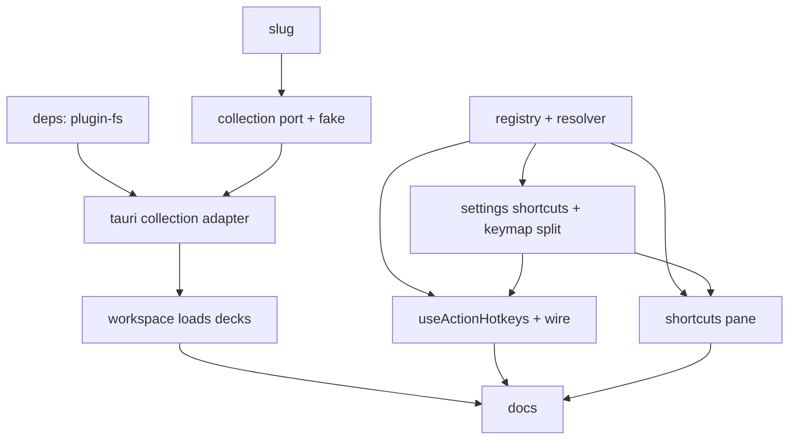

# Plan: User Config - Collections on Disk + Persisted Keymap

**Spec:** docs/features/20260717151949-user-config/spec.md
**Created:** 2026-07-17
**Estimated Effort:** ~1 day
**Status:** Implemented (all ACs verified)
**Coverage threshold:** none (Vitest, no enforced threshold)

## 1. Overview

Two persistence surfaces, both behind ports with a Tauri adapter + in-memory fake, mirroring `requi`:

1. **Collections** - a `CollectionStore` port (`load()` only). Tauri adapter uses `@tauri-apps/plugin-fs`
   to read `collections/*.json` under app-data; seeds the demo decks once if the dir is empty; skips
   corrupt files. In-memory fake backs tests + dev-browser (returns demo decks).
2. **Keymap** - a pure `shortcuts/{registry,resolve}.ts` + a `useActionHotkeys` hook. `Settings` gains a
   `shortcuts` override map persisted to `keymap.json` (split from `settings.json`, matching requi). The
   three hard-coded `useHotkey` calls move behind the registry-driven hook. Settings > Shortcuts pane
   renders the effective bindings read-only.

Approach: **port + two adapters** for both surfaces (same reasoning as the layout feature's
`SettingsStore`): Tauri can't run under jsdom, so a fake is mandatory; and it isolates the alpha-ish fs
plugin behind one seam. Corrupt/missing collapses to a safe default inside the adapter (ADT-style,
`load` never throws) - not scattered try/catch. Keymap resolution is a pure function over registry +
overrides, unit-testable with zero DOM.

## 2. File Structure

```
src/
  lib/
    settings/
      settings.ts                (mod) add `shortcuts: ShortcutOverrides` + `collectionPath?`; merge both
      settings-context.tsx       (mod) add `saveShortcuts(overrides)` action
      tauri-store.ts             (mod) split keymap.json out of settings.json (load+save both files)
    shortcuts/
      registry.ts                (new) ShortcutActionId, ShortcutAction, SHORTCUT_ACTIONS, ShortcutOverrides
      resolve.ts                 (new) safeNormalize, resolveShortcuts (defaults + overrides -> effective)
      use-action-hotkeys.ts      (new) useActionHotkeys(handlers) -> useHotkeys over effective bindings
    workspace/
      slug.ts                    (new) slugify + uniqueSlug (mirrored from requi)
      collection.ts              (new) CollectionStore port; parseDeck (tolerant); serializeDeck
      in-memory-collection.ts    (new) createInMemoryCollectionStore(fileMap?) - fake over Record<slug,string>
      tauri-collection.ts        (new) createTauriCollectionStore() - plugin-fs read/seed
      collection-store-factory.ts(new) createCollectionStore() env-branch (isTauri ? tauri : in-memory demo)
  components/
    workspace/
      workspace-context.tsx      (mod) load decks from CollectionStore (async) instead of DEMO_DECKS prop default
      main.tsx                   (mod) replace useHotkey("Mod+B") with useActionHotkeys({ "toggle-sidebar" })
      study-view.tsx             (mod) replace useHotkey("Space") with useActionHotkeys({ "flip-card" })
      settings-view.tsx          (mod) Shortcuts pane renders SHORTCUT_ACTIONS + effective bindings
  routes/
    __root.tsx                   (mod) ShellPalette Mod+K via useActionHotkeys({ "open-command-palette" })
src-tauri/
  Cargo.toml                     (mod) + tauri-plugin-fs = "2"
  src/lib.rs                     (mod) register tauri_plugin_fs
  capabilities/default.json      (mod) + fs:default + scoped collections read/write
tests/
  collection-store.test.ts       (new) load/seed/corrupt/slug/dev-fallback
  shortcuts-resolve.test.ts       (new) registry shape + resolveShortcuts merge/garbage
  use-action-hotkeys.test.tsx    (new) effective binding fires; overridden binding wins
  settings-keymap.test.ts         (new) shortcuts merge + round-trip through store
  settings-view.test.tsx         (mod) Shortcuts pane lists registry actions + effective bindings
README.md                        (mod) new dep/plugin + collections/ + keymap.json note
docs/learnings.md                (mod) plugin-fs gotchas, keymap split
docs/adr.md                      (mod) collections-on-disk + keymap-split decisions
```

Split by responsibility: `shortcuts/` (pure keymap logic) is independent of `workspace/collection*`
(disk decks). Both hang off the existing `settings/` port. `slug.ts` is shared pure util.

## 3. Task Breakdown

### Task 1: Add `@tauri-apps/plugin-fs` (deps + plugin + capability)

**Files:** Modify - `package.json`, `src-tauri/Cargo.toml`, `src-tauri/src/lib.rs`,
`src-tauri/capabilities/default.json`.

**Interfaces:**
- Produces: `tauri_plugin_fs` registered; `fs:default` + scoped `$APPDATA/collections/**` read+write
  capability; `readDir`/`readTextFile`/`writeTextFile`/`mkdir`/`exists` available to the webview.

- [ ] `npm i @tauri-apps/plugin-fs`; add `tauri-plugin-fs = "2"` to Cargo; register in `lib.rs`; add
  `fs:default` + scope to capability
- [ ] `cargo build` (in `src-tauri/`) compiles with the plugin
- [ ] Commit (`feat(user-config): AC-001 add plugin-fs`)

### Task 2: `slug.ts` (slugify + uniqueSlug)

**Files:** Create - `src/lib/workspace/slug.ts`. Test - `tests/collection-store.test.ts` (slug cases).

**Interfaces:**
- Produces: `slugify(name: string): string`, `uniqueSlug(base: string, used: Set<string>): string`.

- [ ] RED: `slugify("Español!")` -> `"espa-ol"`; `slugify("")` -> `"untitled"`; `uniqueSlug` collision -> `-2`
- [ ] GREEN: mirror requi's `slug.ts` verbatim
- [ ] Commit (`feat(user-config): AC-004 slug helpers`)

### Task 3: `CollectionStore` port + `parseDeck` (tolerant) + in-memory fake

**Files:** Create - `src/lib/workspace/collection.ts`, `src/lib/workspace/in-memory-collection.ts`.
Test - `tests/collection-store.test.ts`.

**Interfaces:**
- Consumes: `Deck`/`Card` from `model.ts`; `slugify`/`uniqueSlug` (Task 2); `DEMO_DECKS`.
- Produces:
  - `type CollectionStore = { load: () => Promise<Deck[]> }`
  - `parseDeck(raw: string): Deck | null` (tolerant: bad JSON/missing fields -> null; drops bad card rows)
  - `serializeDeck(deck: Deck): string`
  - `seedFileMap(decks: Deck[]): Record<string, string>` (slug -> JSON, unique slugs) - used by fake + adapter
  - `createInMemoryCollectionStore(files?: Record<string, string>): CollectionStore`
    (empty/absent -> seeds `DEMO_DECKS` into the map once, then parses; corrupt entries skipped)

- [ ] RED: load 2 valid -> 2 decks; empty map -> seeds demo (map now non-empty) + returns them, 2nd load
  no re-seed; corrupt+partial skipped; bad card row dropped; dup names -> unique slugs
- [ ] GREEN: implement `parseDeck`/`serializeDeck`/`seedFileMap`/fake
- [ ] Commit (`feat(user-config): AC-002,003,005 collection port + fake`)

### Task 4: Tauri collection adapter + env-branch factory

**Files:** Create - `src/lib/workspace/tauri-collection.ts`, `src/lib/workspace/collection-store-factory.ts`.

**Interfaces:**
- Consumes: `CollectionStore`, `parseDeck`, `serializeDeck`, `seedFileMap`, `DEMO_DECKS` (Task 3);
  `@tauri-apps/plugin-fs` (`readDir`,`readTextFile`,`writeTextFile`,`mkdir`,`exists`);
  `@tauri-apps/api/path` (`appDataDir`,`join`); `isTauri` from `@tauri-apps/api/core`.
- Produces:
  - `createTauriCollectionStore(): CollectionStore` - resolves `<appData>/collections`; if no `*.json`,
    seeds `DEMO_DECKS` (write each file) then reads; parses each file with `parseDeck`, skips null.
  - `createCollectionStore(): CollectionStore` - `isTauri() ? tauri : in-memory(demo)`.

- [ ] RED: covered indirectly (adapter is Tauri-only; factory returns in-memory demo in jsdom) - assert
  `createCollectionStore().load()` in jsdom yields demo decks (AC-006/E-6)
- [ ] GREEN: implement adapter + factory
- [ ] Commit (`feat(user-config): AC-001,006 tauri collection adapter + factory`)

### Task 5: Load decks into `WorkspaceProvider`

**Files:** Modify - `src/components/workspace/workspace-context.tsx`; `src/routes/__root.tsx`
(pass `createCollectionStore()` or a resolved deck list).

**Interfaces:**
- Consumes: `CollectionStore` (Task 4).
- Produces: `WorkspaceProvider` accepts a `store?: CollectionStore` (default `createCollectionStore()`),
  loads decks async on mount; until loaded, `decks = []`. Existing `decks?` prop kept for tests.

- [ ] RED: mount provider over an in-memory store with 2 decks -> sidebar shows both after load
- [ ] GREEN: async-load decks in provider; render children throughout (empty list before resolve)
- [ ] Commit (`feat(user-config): AC-001 workspace loads decks from store`)

### Task 6: Shortcut registry + resolver

**Files:** Create - `src/lib/shortcuts/registry.ts`, `src/lib/shortcuts/resolve.ts`.
Test - `tests/shortcuts-resolve.test.ts`.

**Interfaces:**
- Produces:
  - `type ShortcutActionId = "open-command-palette" | "flip-card" | "toggle-sidebar"`
  - `type ShortcutOverrides = Partial<Record<ShortcutActionId, string>>`
  - `type ShortcutAction = { id; name; description; defaultHotkey }`
  - `SHORTCUT_ACTIONS: readonly ShortcutAction[]` (the 3 actions)
  - `safeNormalize(hotkey: string): string | null` (uses `validateHotkey`/`normalizeHotkey`)
  - `resolveShortcuts(overrides: ShortcutOverrides): Record<ShortcutActionId, string>` (default unless a
    valid override; invalid/unknown dropped -> default)

- [ ] RED: registry has 3 unique ids + defaults; resolve: valid override wins, `""`/invalid -> default,
  unknown id absent
- [ ] GREEN: implement registry + resolver (single-binding string, simpler than requi's array)
- [ ] Commit (`feat(user-config): AC-007,008 shortcut registry + resolver`)

### Task 7: Extend `Settings` with `shortcuts` + `collectionPath`; split `keymap.json`

**Files:** Modify - `src/lib/settings/settings.ts` (type + merge), `settings-context.tsx`
(`saveShortcuts`), `tauri-store.ts` (keymap split). Test - `tests/settings-keymap.test.ts`.

**Interfaces:**
- Consumes: `ShortcutOverrides`, `ShortcutActionId`, `safeNormalize` (Task 6).
- Produces: `Settings.shortcuts: ShortcutOverrides` + `Settings.collectionPath?: string`;
  `mergeSettings` merges/sanitizes both (drop unknown ids, non-string/invalid hotkeys);
  `useSettings().saveShortcuts(next: ShortcutOverrides)`; `tauri-store` reads/writes
  `keymap.json` (`shortcuts` key) separately from `settings.json`.

- [ ] RED: `mergeSettings` keeps valid overrides, drops unknown id + invalid hotkey; round-trip: save
  shortcuts via in-memory store, reload -> present
- [ ] GREEN: extend type/merge/context; split keymap file in tauri adapter
- [ ] Commit (`feat(user-config): AC-009,011 settings shortcuts + keymap split`)

### Task 8: `useActionHotkeys` hook + wire the 3 actions

**Files:** Create - `src/lib/shortcuts/use-action-hotkeys.ts`. Modify - `main.tsx`, `study-view.tsx`,
`__root.tsx`. Test - `tests/use-action-hotkeys.test.tsx`.

**Interfaces:**
- Consumes: `resolveShortcuts` (Task 6), `useSettings` (Task 7), `useHotkeys` from `@tanstack/react-hotkeys`.
- Produces: `useActionHotkeys(handlers: Partial<Record<ShortcutActionId, () => void>>): void`.
- Replaces: `useHotkey("Mod+B", ...)` in main.tsx, `useHotkey("Space", ...)` in study-view.tsx,
  `useHotkey("Mod+K", ...)` in __root.tsx - each becomes a `useActionHotkeys({ <id>: handler })` call.

- [ ] RED: mount a probe using `useActionHotkeys({ "flip-card": h })` under a provider with
  `flip-card` overridden to `Enter`; fire `Enter` -> h called; fire `Space` -> not called
- [ ] GREEN: implement hook; rewire the 3 call sites
- [ ] Commit (`feat(user-config): AC-010 useActionHotkeys wiring`)

### Task 9: Settings > Shortcuts pane -> effective bindings (registry-driven)

**Files:** Modify - `src/components/workspace/settings-view.tsx`. Test - `tests/settings-view.test.tsx`.

**Interfaces:**
- Consumes: `SHORTCUT_ACTIONS`, `resolveShortcuts`, `useSettings`, `formatForDisplay` from `@tanstack/hotkeys`.
- Produces: `ShortcutsSection` maps over `SHORTCUT_ACTIONS`, rendering each action name + effective
  binding via `formatForDisplay`. Drops the hard-coded `SHORTCUTS` array.

- [ ] RED: render Settings, open Shortcuts pane -> one row per registry action, each showing its
  effective binding label; overridden action shows the override's label
- [ ] GREEN: replace static list with registry + resolver render
- [ ] Commit (`feat(user-config): AC-012 shortcuts pane effective bindings`)

### Task 10: Docs drift (README, learnings, adr)

**Files:** Modify - `README.md`, `docs/learnings.md`, `docs/adr.md`.

- [ ] README: new dep (`plugin-fs`), `collections/` dir + `keymap.json` note in repo layout
- [ ] learnings: plugin-fs base-dir/scope gotchas; keymap split; single-binding resolver simplification
- [ ] adr: collections-on-disk read-only + keymap.json split rows
- [ ] Commit (`docs(user-config): update README/learnings/adr`)

## 4. Execution Order



Two independent spines: collections (T1-T5) and keymap (T6-T9). Either order; T10 last.

## 5. TDD Strategy

Red-green-refactor on observable behavior. Ports + fakes make every behavior testable without Tauri/fs.

- **Collections** (TC-001..005): drive the in-memory `CollectionStore`. Assert returned `Deck[]`
  (behavior), not fs calls. Seed idempotency: assert the file map gains entries on first load and the
  second load returns the same decks without adding entries.
- **Keymap resolve** (TC-006,007): pure-function assertions over `SHORTCUT_ACTIONS` + `resolveShortcuts`.
- **Keymap round-trip** (TC-008): save via in-memory `SettingsStore`, reload, assert override present.
- **Wiring** (TC-009): mount a probe with `useActionHotkeys`, fire keydown, assert handler runs on the
  overridden key and not the default. Under jsdom `Mod` -> `Control` (see learnings); pick a bare-key
  override (`Enter`) to avoid platform-modifier ambiguity in the test.
- **Settings render** (TC-010): render the pane, assert a row per registry action with its binding label.

RED subagent writes these first (to completion, confirm red) **before** any production code - the
layout feature's learning: parallel RED defeats the gate.

## 6. Key Decisions (Decision Log)

| Date | Decision | Rationale |
| ---- | -------- | --------- |
| 2026-07-17 | Design gate: evaluated pz-ddd / pz-archetypes / pz-codebase-design. Invoked **pz-codebase-design** only. | Two new deep seams (`CollectionStore` fs port, keymap resolver) - interface shape mirrored from requi's `WorkspaceFs`+shortcuts, not invented. ddd/archetypes N/A: `Deck`/`Card` already modeled; no accounting/inventory/ordering/pricing shape - just file IO + a pure lookup table. |
| 2026-07-17 | Scope = 3 sub-tasks on one branch (settings already done; build collections + keymap). | User pick. settings.json shipped in layout; only the 2 new disk surfaces remain. |
| 2026-07-17 | Collections **read-only + seed-once** (no in-app CRUD, `CollectionStore` has no `save`). | Mirrors requi `workspace-config` (read-only, hand-edited). CRUD is a later feature. YAGNI. |
| 2026-07-17 | Keymap **persist-only** (overrides honored + Settings shows effective bindings; no in-app recorder). | Mirrors requi's deferral pattern. Recorder UI is a later feature. |
| 2026-07-17 | Add `@tauri-apps/plugin-fs` (vs modeling each deck as its own `LazyStore`). | `LazyStore` can't enumerate a directory; disk-discovery of decks needs `readDir`. Behind a `CollectionStore` port + in-memory fake, matching requi's `tauri-fs`. |
| 2026-07-17 | Single-binding `ShortcutOverrides` (`actionId -> string`), not requi's multi-binding `string[]`. | Only 3 actions, no multi-bind requirement. Simpler resolver; can widen to `string[]` later if needed. |
| 2026-07-17 | Split `keymap.json` from `settings.json` in the tauri adapter (mirrors requi). | Keymap is device-syncable on its own; keeps the settings file focused. |

## 7. Risks and Mitigations

| Risk | Impact | Mitigation |
|------|--------|------------|
| `plugin-fs` capability scope wrong -> read/write of `collections/` denied at runtime | Decks never load in packaged app | Scope `$APPDATA/collections/**` in capability; verify with a real `npm run tauri build` + install-app.sh run before closing |
| `appDataDir()` path join differs from the store plugin's dir -> collections land elsewhere than settings.json | Confusing split state | Derive `collectionPath` from the same `appDataDir()` used by the store; document in learnings |
| jsdom `Mod`->`Control` makes `Mod+K`/`Mod+B` wiring tests ambiguous | Flaky/foggy tests | Test wiring with a bare-key override (`Enter`); reuse the `fireEvent.keyDown(document,{key,code,ctrlKey})` pattern from layout tests for Mod combos |
| Splitting `keymap.json` breaks the existing settings round-trip test | Regression | Keep `settings.json` load/save intact; add keymap as a second file read/written in the same adapter; existing `settings-store.test.ts` stays green |
| Seed writes demo decks on every launch (idempotency bug) | Hand-edits get clobbered | Seed only when zero `*.json` present; test the second-load-no-reseed path explicitly |

## 8. Acceptance Verification

Status: **all ACs PASS** (verified by two fresh-context verifier subagents; flaky-regression + 2 missing tests found in pass 1, fixed, confirmed closed in pass 2 with 5 consecutive green runs).

| AC | Criterion | Test(s) / Evidence | Status |
|----|-----------|--------------------|--------|
| AC-001 | Decks read from `collections/*.json` on launch, survive restart | `collection-store.test.ts` "should load every valid deck file..."; `workspace-load.test.tsx` "should load decks from an injected CollectionStore into the workspace" (async seam); tauri adapter logic-reviewed (unrunnable under jsdom) | Pass |
| AC-002 | First run seeds demo decks once | `collection-store.test.ts` "should write one file per demo deck... and not re-seed on the second" (asserts map size unchanged on 2nd load) | Pass |
| AC-003 | Corrupt/partial deck skipped; bad card dropped | `collection-store.test.ts` "should skip malformed and partial files..." + "should drop bad card rows from an otherwise valid deck on load" | Pass |
| AC-004 | Slug per deck, de-duplicated | `collection-store.test.ts` slugify/uniqueSlug/seedFileMap dedup cases (`spanish`,`spanish-2`) | Pass |
| AC-005 | Access via port; tests use fake | in-memory `CollectionStore` used in every collection test + workspace-load test | Pass |
| AC-006 | fs unavailable -> demo decks | `collection-store.test.ts` "should return the demo decks if fs is unavailable in a non-Tauri env" (real `isTauri()` branch in jsdom) | Pass |
| AC-007 | Registry is the single action list | `shortcuts-resolve.test.ts` "should define exactly the three in-scope actions..." + default-hotkey + name/description cases | Pass |
| AC-008 | Resolver merges defaults+overrides, drops garbage | `shortcuts-resolve.test.ts` resolveShortcuts + safeNormalize cases | Pass |
| AC-009 | Override honored + persists | `settings-keymap.test.ts` round-trip (in-memory port); `tauri-store-keymap.test.ts` "should write shortcuts to keymap.json..." + "should re-merge shortcuts from keymap.json back into the loaded Settings" | Pass |
| AC-010 | Actions wired via `useActionHotkeys` | `use-action-hotkeys.test.tsx` overridden Enter fires + default Space does not | Pass |
| AC-011 | Corrupt shortcuts map -> defaults | `settings-keymap.test.ts` mergeSettings drops unknown id / invalid / empty / non-object | Pass |
| AC-012 | Shortcuts pane lists effective bindings | `settings-view.test.tsx` "should render one row per registry action..." + effective + override label | Pass |
| AC-013 | lint+typecheck+test+cargo build green | lint 0 err (5 pre-existing warnings), typecheck 0 err, 90/90 vitest (5x consecutive), cargo build ok, cargo test 0 tests | Pass |

### Deviations from plan
- Two tests were added after verifier pass 1 flagged them missing: `workspace-load.test.tsx` (AC-001 async load seam - plan Task 5 promised it) and `tauri-store-keymap.test.ts` (AC-009 real keymap.json split - only the in-memory round-trip existed).
- The async deck-load in `WorkspaceProvider` initially raced the pre-existing `layout-shell.test.tsx` sync deck queries (flaky ~40-60%). Fixed by passing `decks={DEMO_DECKS}` (sync-inject path) at both provider render sites in those shell tests; the async path is now covered by the dedicated `workspace-load.test.tsx` instead.
- REFACTOR: honored `settings.collectionPath` in the tauri adapter + factory (was a dead field), mirroring requi's `workspacePath`-on-load.
- No Rust unit test (plan Task 10 didn't require one); plugin-fs registration covered by `cargo build`.
